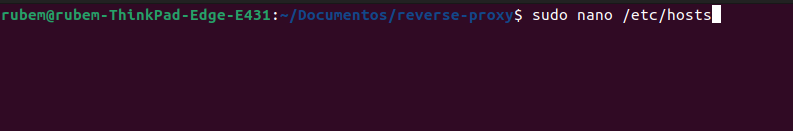
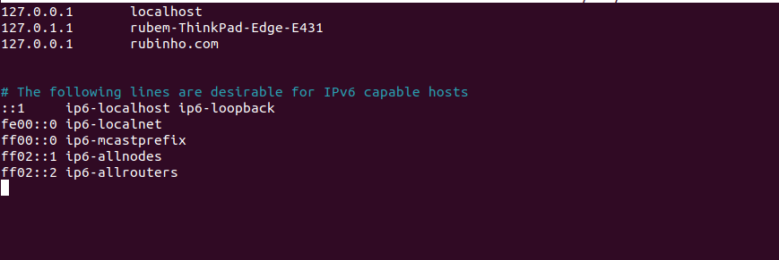
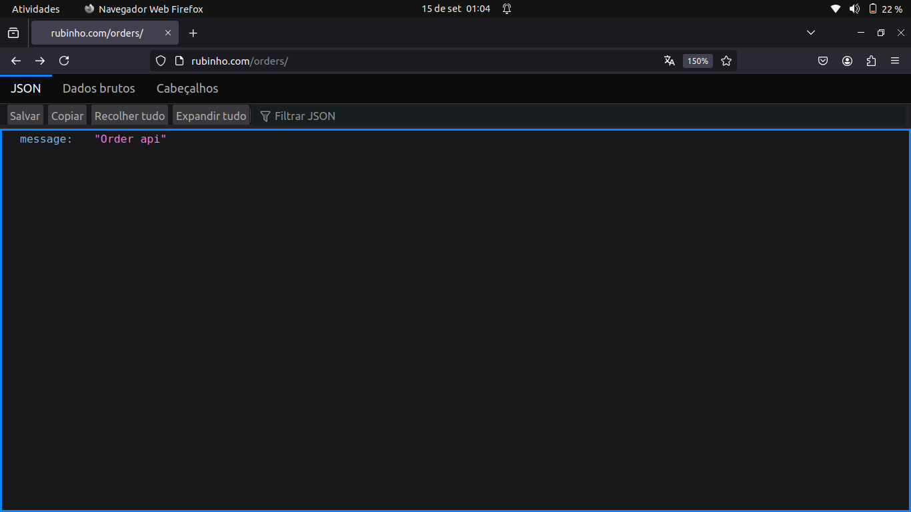

## Instruções

1. Clone o repositório para o seu ambiente local.
2. Execute o comando `sudo docker compose up --build` para instalar as dependências e executar os containers.
3. Configure o arquivo de configuração `default.conf` mude o server_name para localhost, caso não consiga criar uma instancia no etc/hosts.

##

##

O proxy reverso tem como objetivo centralizar as APIs, permitindo que todas as requisições sejam direcionadas para um único ponto de entrada. Isso facilita o gerenciamento e a manutenção das APIs, além de possibilitar a implementação de recursos como balanceamento de carga e cache.

